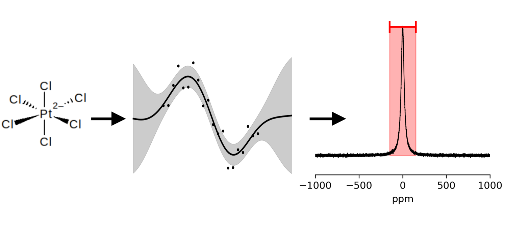

# Uncertainty-aware prediction of 195Pt chemical shifts

This repository provides the datasets and machine learning models used in our publication:

> **A. Meßler and H. Bahmann*, “Uncertainty-aware prediction of 195Pt chemical shifts,” *submitted to: Journal of Chemical Information and Modeling*, 2025.**

The code and default configurations of each ML model as well as the dataset used in our work are included.

To reproduce the results for each of the three models presented in the paper, we provide a notebook (`src/example_use.ipynb`).
All molecular structures used in this work can be found in `data/structures/total/` and the corresponding labels in `data/labels/total_set_clean_120525.csv`. 
